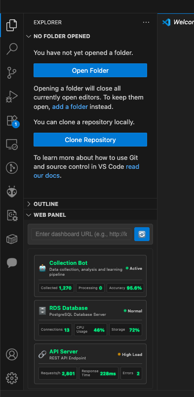

# Web Panel for VS Code

Display web dashboards directly within VS Code using webview panels or side views. Perfect for monitoring services, viewing analytics, or keeping any web-based dashboard accessible while coding.



## Features

- **Dashboard Panel View**: Open any web dashboard in a dedicated VS Code panel
- **Sidebar Integration**: Pin dashboards to the Explorer sidebar for persistent access
- **Full Web Support**: Navigate to any URL with complete JavaScript support
- **Flexible Layout**: Use as a floating panel or docked sidebar view
- **Default Dashboard**: Built-in sample dashboard for testing
- **Real-time Updates**: Dashboards update in real-time just like in a browser

## Installation

1. Install from the VS Code Marketplace (coming soon)
2. Or install the `.vsix` file directly:
   ```bash
   code --install-extension vscode-web-panel-*.vsix
   ```

## Default Dashboard (No URL Specified)

When no URL is entered, a built-in sample dashboard (dummy HTML) is displayed. You can freely customize this dashboard by editing `src/dashboard-template.html`.


### Example: Default Dashboard HTML (Full Source)

You can copy and paste the entire default dashboard template below to create your own stylish dashboard. Edit freely for your service!

```html
<!-- src/dashboard-template.html -->
...existing code from the file dashboard-template.html...
```

> **Tip:** For the latest version, see [`src/dashboard-template.html` on GitHub](https://github.com/dkurokawa/vscode-web-panel/blob/main/src/dashboard-template.html)

**How to customize:**
- Edit `src/dashboard-template.html` to change the default dashboard.
- The default dashboard is shown when no URL is entered in the panel.
- You can add, remove, or style service items as you like.

For advanced customization, you can also edit the CSS and JavaScript in `dashboard-template.html`.

---

## Usage

### Opening a Dashboard Panel

1. Open Command Palette (`Ctrl+Shift+P` / `Cmd+Shift+P`)
2. Run `Open Dashboard Panel`
3. A new panel opens with a default dashboard
4. Enter any dashboard URL in the input field and press Enter or click the refresh button

### Using the Sidebar View

1. Open the Explorer sidebar
2. Find the "Web Panel" section
3. Enter a dashboard URL in the input field
4. The dashboard loads directly in the sidebar

### Supported Dashboards

This extension can display any web-based dashboard, including:
- Grafana dashboards
- Kibana visualizations
- Custom monitoring dashboards
- Analytics platforms
- Admin panels
- Any web application

## Extension Settings

This extension contributes the following settings:

### Display Settings
* `web-panel.renderMode`: How to render web content
  - `iframe` (default): Secure but some sites may block embedding
  - `fetch`: Works with all sites but less secure

### Navigation Settings
* `web-panel.navigation.enabled`: Allow navigation within the panel (default: true)
* `web-panel.navigation.allowExternal`: Allow navigation to external domains in iframe mode (default: false)

### Security Settings
* `web-panel.security.sandboxLevel`: Sandbox restrictions for iframe mode
  - `strict`: Minimal permissions (scripts and same-origin only)
  - `medium` (default): Balanced security (+ forms and popups)
  - `relaxed`: Most features enabled (+ modals and top navigation)

### Usage Examples

**For maximum compatibility (less secure):**
```json
{
  "web-panel.renderMode": "fetch",
  "web-panel.navigation.enabled": true
}
```

**For maximum security (may not work with all sites):**
```json
{
  "web-panel.renderMode": "iframe",
  "web-panel.security.sandboxLevel": "strict",
  "web-panel.navigation.enabled": false
}
```

## Development

### Testing the Extension

1. Clone this repository
2. Run `npm install`
3. Press `F5` to launch a new VS Code window with the extension loaded
4. Test with the included dashboard server:
   ```bash
   node test-dashboard-server.js
   ```
   Then use `http://localhost:3019/dashboard` as your dashboard URL

### Building

```bash
npm run compile
```

### Packaging

```bash
vsce package
```

## Requirements

- VS Code version 1.102.0 or higher

## Known Issues

- Some websites may block embedding in iframes due to security policies
- Authentication for dashboards must be handled within the webview
- Navigation history is not preserved between sessions

## Contributing

Contributions are welcome! Please feel free to submit a Pull Request.

## License

[MIT](LICENSE)

---